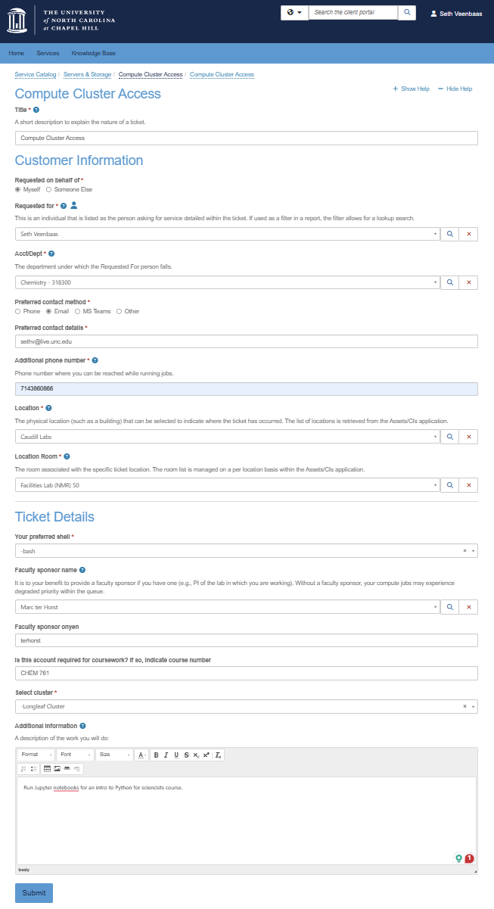

# Get Longleaf access (UNC research computing)

The Longleaf cluster is a Linux-based computing system available to researchers at UNC free of charge. In this course we will use Longleaf to run Python code in Jupyter notebooks.

<h2>Glossary:</h2>

**Python:** a popular computer language for science, data science, and general use.

**Jupyter notebook:** an interactive environment that can display notes (markdown), run python code, and display the output of code.

**Longleaf:** UNC research computing compute cluster. (aka: a super computer accessible to UNC researchers)

**Longleaf On Demand:** a user-friendly web-portal that provides a graphical interface for apps including Jupyter.

## Request a Longleaf account

Request an account by following these steps.

1) Go to [help.unc.edu](https://help.unc.edu) and log in with your onyen.
2) Search for **`Compute Cluster Access`** in the catalog section of [help.unc.edu](https://help.unc.edu).
3) Click on **`Computer Cluster Access`**.
4) Click **`Request Access`** to complete the service request form and submit. If you are unsure how to answer a field, you can copy the form below:

    

You will be notified by email when your account is ready!
