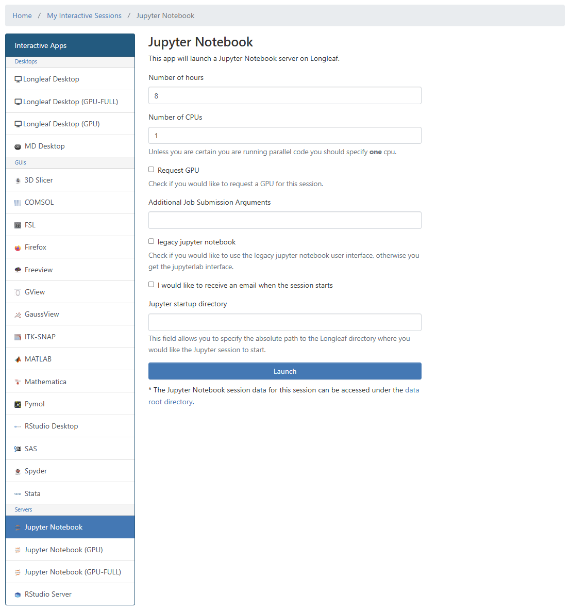
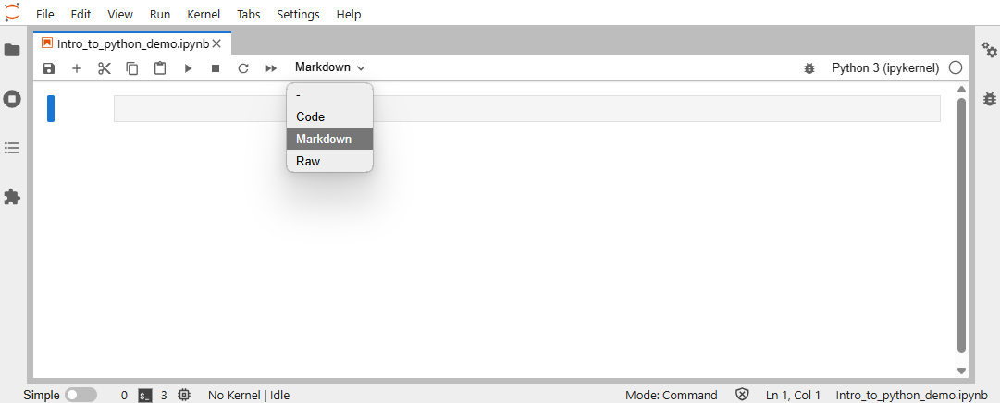
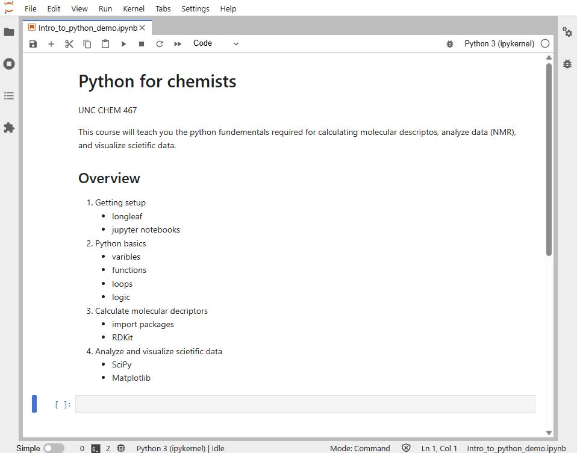
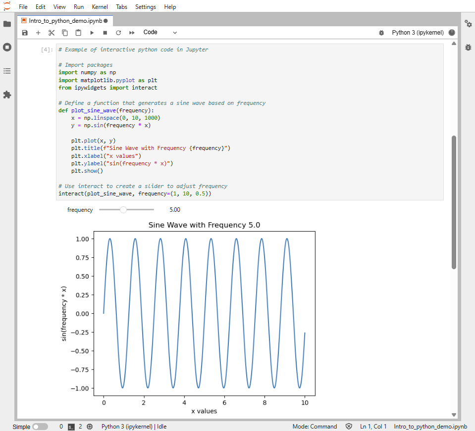
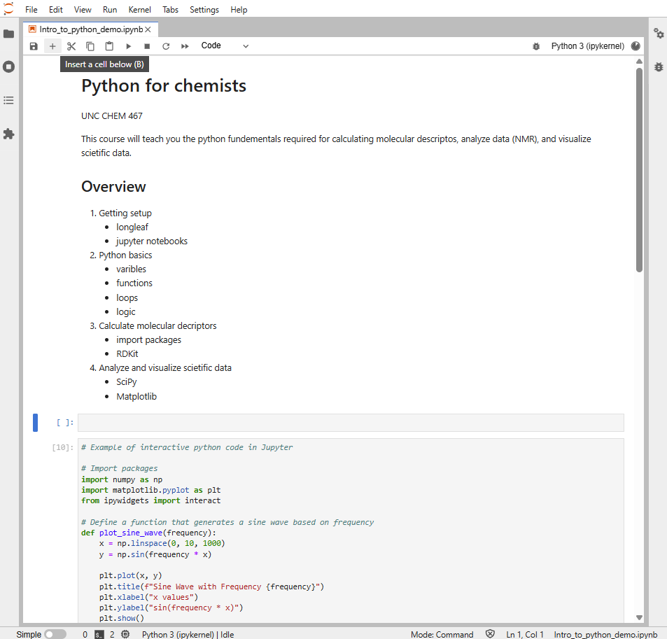
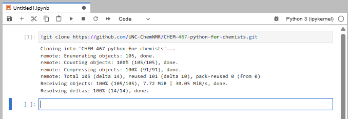
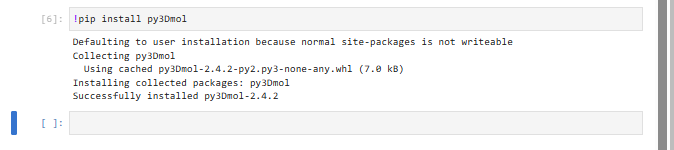
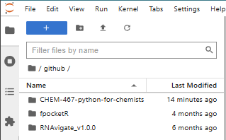
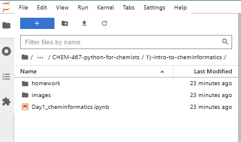

# Setup Jupyter via Longleaf On Demand

**Super Important:** Make sure you complete the [First-time setup](#first-time-setup-super-important) section at the end of this document or you will not be able able to start the coursework for CHEM 467.

Once your account is approved you will be able to access Longleaf. There are many ways to access Longleaf, but we will be using Longleaf On-Demand for this course.

## Access Jupyter via Longleaf On Demand

1) Go to [https://ondemand.rc.unc.edu/pun/sys/dashboard](https://ondemand.rc.unc.edu/pun/sys/dashboard) (You may want to bookmark this site for quick access throughout the course).
2) Sign in using your onyen. 
3) Click on `Jupyter Notebook`.
4) Request resources and click `Launch`.
   - **Number of hours**: 8 hr. maximum
   - **Number of CPUs**: 1 is sufficient

    

6) Wait for computing resources to be allocated to you (~1 minute).
7) Click `Connect to Jupyter`.
8) In the **Launcher** and under the section labeled **Notebook**, click `Python3 (ipkernel)` to open a notebook running Python.

    

## Setting up your Jupyter notebook

Jupyter notebooks are made up of two main types of cells: **Markdown cells** and **Code cells**.
You run a Jupyter notebook one cell at a time by click inside the cell and press `shift+enter`.

### Markdown cells

Jupyter notebooks allow us to use a language called Markdown to type notes and descriptions in markdown cells. 
It’s a good practice to have your first cell be markdown to explain the purpose of the notebook.

### Basic markdown syntax 

In the Markdown language, we create headers and lists using the following syntax.

| Element        | Basic Markdown Syntax                                      |
| -------------- | ---------------------------------------------------------- |
| Heading        | `#` H1 <br> `##` H2 <br> `###` H3                          |
| Ordered List   | `1.` First item <br> `2.` Second item <br> `3.` Third item |
| Unordered List | `-` First item <br> `-` Second item <br> `-` Third item    |

### Let’s practice! 

1. Open a new Jupyter notebook using the [instructions above](#access-jupyter-via-longleaf-on-demand). 
2. Click the first cell.
3. Select `Markdown` from the cell type dropdown menu in the notebook ribbon (shown below).

    

4. Paste the following into the markdown cell.

    ```markdown
    # Python for chemists

    UNC CHEM 467

    This course will teach you the python fundementals required for calculating molecular descriptos, analyze data (NMR), and visualize scietific data.

    ## Overview

    1. Getting setup
        - longleaf
        - jupyter notebooks
        
    2. Python basics
        - varibles
        - functions
        - loops
        - logic
        
    4. Calculate molecular decriptors
        - import packages
        - RDKit
        
    5. Analyze and visualize scietific data
        - SciPy
        - Matplotlib
    ```

5. Press `shift+enter` (or click the play button `▶` in the notebook ribbon) to run the markdown cell. After running, Markdown cell should look like the following:


    

### Code cells

Jupyter notebooks allow us to run python code interactively and display the outputs all in one file. These features make Jupyter notebooks good for prototyping new code and for keeping a record of how you analyzed your data.

### Let’s practice! 

1. Paste the following interactive python code into the empty code cell below your Markdown cell.

    ```Python
    # Example of interactive python code in Jupyter

    # Import packages
    import numpy as np
    import matplotlib.pyplot as plt
    from ipywidgets import interact

    # Define a function that generates a sine wave based on frequency
    def plot_sine_wave(frequency):
        x = np.linspace(0, 10, 1000)
        y = np.sin(frequency * x)
        
        plt.plot(x, y)
        plt.title(f"Sine Wave with Frequency {frequency}")
        plt.xlabel("x values")
        plt.ylabel("sin(frequency * x)")
        plt.show()

    # Use interact to create a slider to adjust frequency
    interact(plot_sine_wave, frequency=(1, 10, 0.5))
    ```

    **Note:** in Python (and therefore in Jupyter code cells) the # symbol is used to denote comments that will not be interpreted as code.

2. Press `shift+enter` (or click the play button `▶` in the notebook ribbon) to evaluate the code cell. Now your notebook should look like the following:

    

    **Note:** move to the frequency slider to interact with the output.

### How to insert and delete cells

1. Insert a new cell below your markdown cell.
    - click the markdown cell
    - click the `+` button in the ribbon to insert a cell below

    Now your notebook should look like the following:

    

2. Delete the empty cell.
    - right-click the cell
    - click `Delete Cells`


## First-Time Setup (Super important)

### Clone the class repository

This will copy all the course material into your Longleaf storage.

1) Create a new code cell. 
2) Paste this code into the code cell:

    `!git clone https://github.com/UNC-ChemNMR/CHEM-467-python-for-chemists.git`

3) Run the code cell by pressing `shift+enter` (or click the play button `▶` in the notebook ribbon).
4) You should see an output that looks similar to this:

    

### Install py3Dmol

1) Create a new code cell.
2) Paste this code into the code cell:

    `!pip install py3Dmol`

3) Run the code cell by pressing `shift+enter` (or click the play button `▶` in the notebook ribbon).
4) You should see an output that looks similar to this:

    


### Navigating the course material in Jupyter

1) You should now see a folder (also called a directory) containing all the course material in the **File Browser** panel:

    

2) You can double-click on the course folder to open it. 

    

3) In-class notebooks (.ipynb) and homework templates (.ipynb) are located inside the numerated sub-directories.

    

You are finished setting up Longleaf and Jupyter for CHEM 467!

## Additional resources

Hopefully you have a good idea of how to run a Jupyter notebook in Longleaf now! If you have more questions take a look at the following resources.

- [Longleaf OnDemand](https://help.rc.unc.edu/ondemand)
- [Jupyter notebook user interface](https://jupyter-notebook.readthedocs.io/en/latest/notebook.html#notebook-user-interface)

